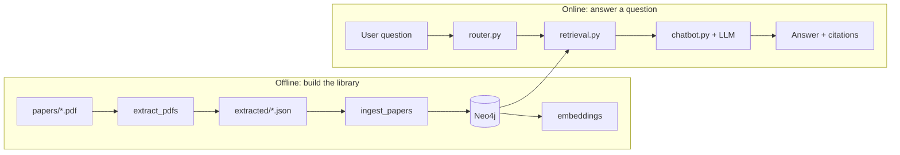
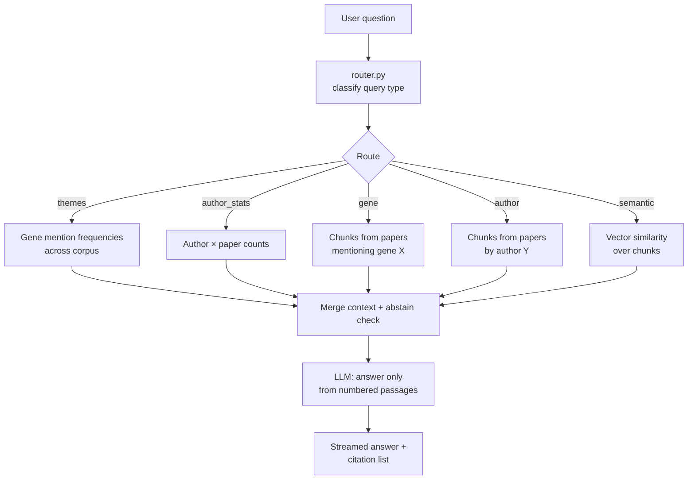
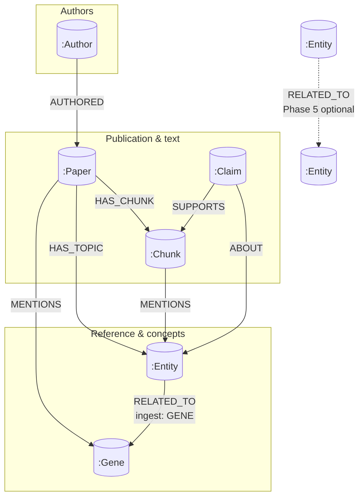

# Devreotes Lab Research Chatbot — Presentation Deck (Markdown)

Use this file as **slide-by-slide talking points** and **architecture figures**. Mermaid diagrams render in GitHub, many IDEs, and tools like [Marp](https://marp.app/), [Slidev](https://sli.dev/), or Pandoc.

**Deeper detail:** [`ARCHITECTURE_AND_USAGE.md`](./ARCHITECTURE_AND_USAGE.md) · **Runbook:** [`structure.md`](./structure.md) · **README:** [`README.md`](./README.md)

---

## Slide 1 — Title

**GraphRAG Q&A over a lab PDF corpus**

- **Neo4j** — papers, chunks, genes, authors, vector search  
- **OpenAI** — answers **only** from retrieved evidence, with citations  
- **Nuxt UI** — streaming chat, retrieval trace, citation tooltips  

*Capstone: Devreotes Lab Research Chatbot*

---

## Slide 2 — The problem

| Need | What we built |
|------|----------------|
| **Grounding** | Answers must come from *this* corpus, not the model’s general knowledge |
| **Verifiability** | Numbered citations `[1]`, `[2]` … tied to specific chunk passages |
| **Right tool for the question** | Sometimes *semantic similarity*, sometimes *filter by gene/author*, sometimes *graph statistics* |

**Idea:** **GraphRAG** — graph stores structure; **retrieval** finds text; **LLM** is the *writer*, not the *source of truth*.

---

## Slide 3 — Two modes: offline vs online

Think of a **library**: first you **build the catalog** (once per corpus change), then **patrons ask questions**.

| Phase | Analogy | What happens |
|-------|---------|----------------|
| **Offline** | Shelving & indexing | PDFs → text → Neo4j → embeddings on chunks |
| **Online** | Reference desk | Question → route → retrieve → LLM answers with citations |



---

## Slide 4 — Full system architecture (runtime)

The **browser** does not talk to Neo4j directly. **Nuxt** (Nitro) streams the answer; **Python** runs the same `chatbot.py` logic via a **subprocess bridge** (NDJSON) or an optional **FastAPI** HTTP backend.

```mermaid
flowchart TB
  subgraph offline["Offline: build corpus"]
    PDF["papers/ → extract → extracted/"]
    PIPE["schema → ingest → embeddings"]
    PDF --> PIPE
  end

  NEO[("Neo4j\n(graph + vector index)")]
  PIPE --> NEO

  subgraph clients["Clients"]
    BR["Browser\n(Nuxt UI)"]
    GR["Gradio\napp.py"]
  end

  subgraph nuxt["Nuxt server (Nitro)"]
    API["POST /api/devreotes/chats/:id\n(SSE / AI SDK stream)"]
    APPDB[("App DB\nmessages, traces)"]
    BRG["devreotes_bridge.py\n(NDJSON stdout)"]
  end

  subgraph fastapi["Optional: DEVREOTES_API_URL"]
    FAPI["FastAPI\nPOST /chat/stream"]
  end

  subgraph core["Python backend (backend/app)"]
    CHAT["chatbot.py\n(router vs agent)"]
    ROUT["router.py"]
    AGT["agent_tools"]
    RETR["retrieval.py\nvector + Cypher"]
  end

  LLM["OpenAI API"]

  BR --> API
  API --> APPDB
  API --> BRG
  API -.->|optional| FAPI
  FAPI --> CHAT
  BRG --> CHAT
  GR --> CHAT
  CHAT --> ROUT
  CHAT --> AGT
  ROUT --> RETR
  AGT --> RETR
  RETR --> NEO
  CHAT --> LLM
```

**Talking point:** Retrieval always hits **Neo4j**; the LLM only sees **retrieved** text + the user question.

---

## Slide 5 — Nuxt demo path (what you show on screen)

1. Start from `nuxt/`: `pnpm dev` (after `pnpm install` and `pnpm db:migrate`).  
2. Set **`DEVREOTES_PYTHON`** to your venv’s `python` so the bridge finds `chatbot.py` and dependencies.  
3. Backend: `NEO4J_*`, `OPENAI_API_KEY` in the Devreotes project `.env` (see `.env.example`).  

**UI highlights:**

- **Streaming** assistant text  
- **Citations** `[n]` with tooltips (title / source)  
- **Retrieval trace** (collapsible): route, counts, `retrieval_preview`, `sources`  
- **Thread memory (HTTP path):** recent turns + rolling summary for follow-up questions

---

## Slide 6 — Question → answer (logical flow)



**Router vs agent (`DEVREOTES_RAG_MODE`):**

- **router (default):** one route, one retrieval pass — predictable for demos.  
- **agent:** model may call multiple tools (`semantic_search`, `gene_literature_search`, …) before answering.

**Conversation behavior:** within a chat thread, Nuxt sends the last **10** turns (`messages`) plus a rolling `summary` to FastAPI; backend uses it for reference resolution while still citing retrieved corpus evidence.

---

## Slide 6.5 — Conversational properties (thread scope)

| Property | Value / default | Notes |
|----------|------------------|-------|
| `messages` | Last `N` turns (`N=10`) | Sent by Nuxt to `POST /chat/stream` (FastAPI path) |
| `summary` | `chats.summary` (rolling) | Updated after each assistant response |
| Summary model | `openai/gpt-4o-mini` | Configurable via `DEVREOTES_SUMMARY_MODEL` |
| Max summary length | `1500` chars | `DEVREOTES_SUMMARY_MAX_CHARS` |

Bridge mode (`devreotes_bridge.py`) remains plain-question stdin and does not send structured history.

---

## Slide 7 — Neo4j graph model (summary)

**Nodes:** `Paper`, `Chunk` (with **embedding** for vector index), `Gene` (HGNC), `Author`, optional `Entity`, `Claim`.



**Key relationships:**

| Pattern | Meaning |
|---------|---------|
| `(:Paper)-[:HAS_CHUNK]->(:Chunk)` | Text units for search and citations |
| `(:Paper)-[:MENTIONS]->(:Gene)` | Corpus-level gene link (HGNC-backed) |
| `(:Author)-[:AUTHORED]->(:Paper)` | Author-scoped retrieval |
| Chunk **embedding** | Powers **semantic** / hybrid retrieval |

---

## Slide 8 — Tech stack (elevator list)

| Layer | Choice | Why |
|-------|--------|-----|
| Graph + vectors | **Neo4j** | Papers and “mentions” are naturally a graph; native vector index on chunks |
| PDF text | **PyMuPDF** | Fast, local extraction |
| Gene names | **HGNC** + **scispaCy** | Canonical symbols, fewer duplicate nodes |
| Embeddings | **SentenceTransformers** (PubMed-tuned) | Same space for question vs chunk |
| Generation | **OpenAI** (via `chatbot.py`) | Strong instruction-following for citations |
| UI | **Nuxt + AI SDK** | Streaming, persistence, modern UX |

---

## Slide 9 — Example demo queries (by route)

| Goal | Example question |
|------|------------------|
| **Semantic** | “How does chemotaxis relate to cell polarity in these papers?” |
| **Gene** | “What do the papers say about **PTEN**?” |
| **Author** | “What passages discuss chemotaxis in papers by **Devreotes**?” |
| **Themes (gene counts)** | “Which **genes** are **most mentioned** across the corpus?” |
| **Author stats** | “**Which authors** appear on **more than one paper**?” |

Use **router** mode for a predictable sequence; spell gene symbols in **ALL CAPS** when possible.

---

## Slide 10 — Design principles (closing)

1. **Corpus-grounded** — The graph and chunks are the source of truth; the LLM composes answers from evidence.  
2. **Explainable** — Chunks, scores, and traces can be inspected; citations map to real text.  
3. **Pragmatic graph** — Model what helps **search**, **filters**, and **stats** for this lab corpus—not everything in the biomedical ontology.

**Questions?** Point reviewers to [`ARCHITECTURE_AND_USAGE.md`](./ARCHITECTURE_AND_USAGE.md) for full narrative and environment tables.
